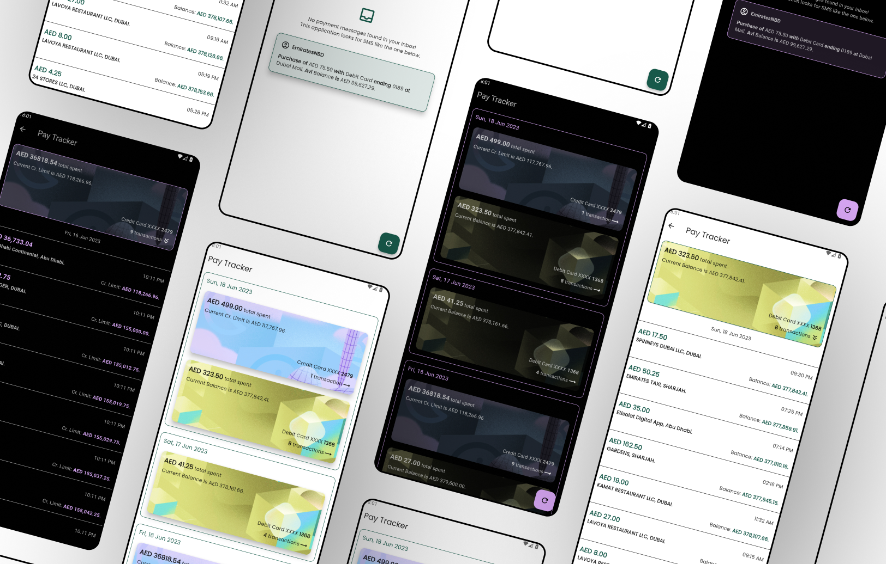

# Pay Tracker - ENBD bank SMS reader
An Android application built using [Flutter](https://flutter.dev/), for reading SMS payment notifications from [ENBD(Emirates NBD)](https://www.emiratesnbd.com/en) bank and displaying the details beautifully and intuitively.

#### Here is the flow:
1. Make a payment using your ENBD Debit/Credit card
2. Receive an SMS notification for the payment from the bank
3. Open the Pay Tracker application
4. Pay Tracker displays the details in a beautiful way

# Download
Platform  | Download Link
------------- | -------------
Android  | [.apk Installer file](Download/android_app_pay_tracker.apk)

# Other Details
> If you want to use this application in your Android device, you may download the Android application from the above link. If you have trust issues, do not download/install the application. Everything you do is at your own risk. If you are a developer, you may also fork the source code and build the application by yourself and install it in your device.

> For testing, set **useMockData** variable to **true** in the [development_constants.dart file](lib/constants/development_constants.dart) to use the application with dummy SMS data.

> I am using this application for reading SMS from Emirates NBD bank in the United Arab Emirates. By making changes to the **regExp** regex in [sms_reader_constants.dart file](lib/constants/sms_reader_constants.dart), you may read SMS from other banks as well.